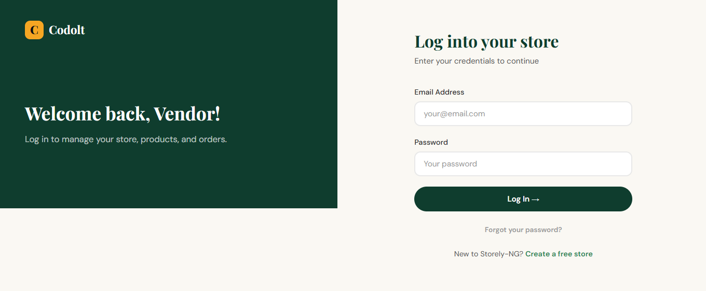
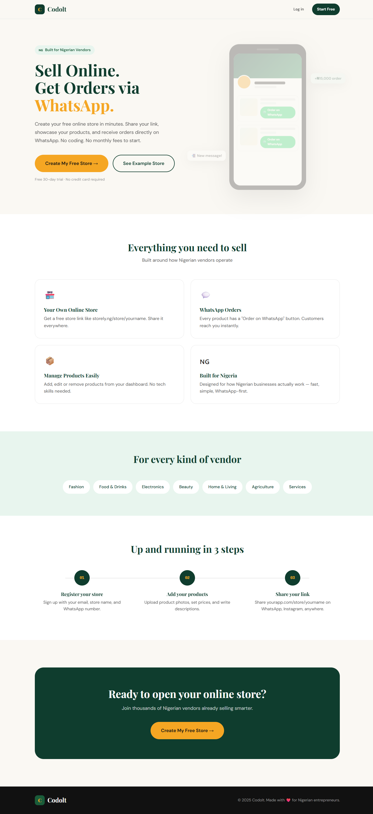
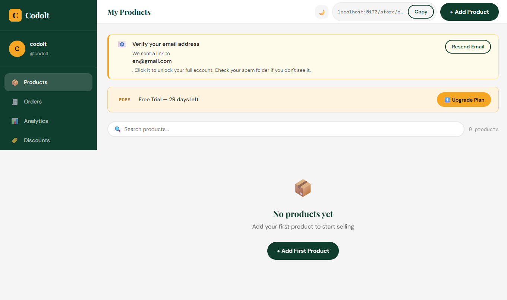
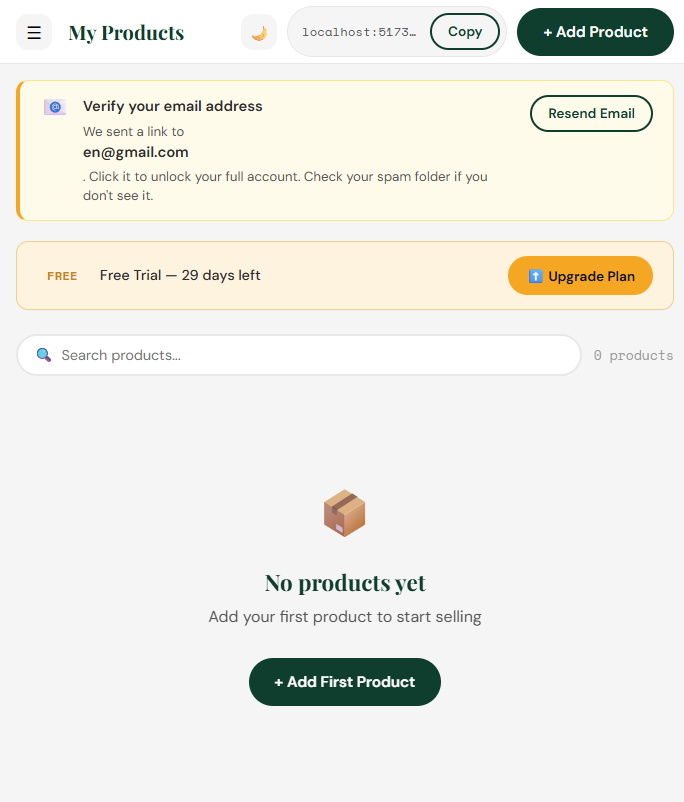

# Vendor Platform

A full-stack online marketplace platform built with **React, Node.js, Express, and MongoDB Atlas**. The platform provides a foundation for connecting customers with vendors, managing user accounts, shopping carts, and orders.

## Features

* **User Authentication** — Secure user registration and login.
* **Authorization** — Controls access to protected resources and functionality.
* **Database Integration** — Persistent application data stored in MongoDB Atlas.
* **Responsive UI** — User interface built with React and Vite.
* **Shopping Cart** — Users can add and manage products in their cart.
* **Order Management** — Users can create and manage orders through the platform.

## Screenshots

Here are some screenshots of the Vendor Platform interface.

### Login



### Main Page



### Platform Page



### Mobile View



## Tech Stack

### Frontend

* React
* Vite
* JavaScript
* HTML5
* SCSS

### Backend

* Node.js
* Express.js
* REST API

### Database

* MongoDB Atlas
* MongoDB

## Project Structure

```text
vendor3/
│
├── backend/        # Node.js + Express backend/API
│
├── frontend/       # React + Vite frontend application
│
├── mobile/         # Mobile application module
│
├── shared/         # Shared code and resources
│
└── docs/
    └── screenshot/
        ├── login.png
        ├── mainPage.png
        ├── mobile.png
        └── page.png
```

## Architecture

```text
                ┌──────────────────────┐
                │       Frontend       │
                │    React + Vite      │
                └──────────┬───────────┘
                           │
                           │ HTTP / REST API
                           ▼
                ┌──────────────────────┐
                │       Backend        │
                │  Node.js + Express   │
                └──────────┬───────────┘
                           │
                           │ MongoDB Driver
                           ▼
                ┌──────────────────────┐
                │     MongoDB Atlas    │
                │       Database       │
                └──────────────────────┘
```

## Getting Started

### Prerequisites

Before running the project, make sure you have installed:

* Node.js
* npm
* Git
* A MongoDB Atlas account

You will also need a MongoDB Atlas connection string for the backend.

## Installation

### 1. Clone the repository

Clone the project from your GitHub repository:

```bash
git clone <YOUR_REPOSITORY_URL>
```

Then enter the project directory:

```bash
cd vendor3
```

> Replace `<YOUR_REPOSITORY_URL>` with the actual GitHub repository URL.

### 2. Install backend dependencies

```bash
cd backend
npm install
```

### 3. Configure backend environment variables

Create a `.env` file inside the `backend` directory.

For example:

```env
PORT=5000
MONGODB_URI=your_mongodb_atlas_connection_string
JWT_SECRET=your_jwt_secret
```

Use the exact environment-variable names expected by your backend code if they differ from these examples.

**Do not commit your `.env` file to GitHub.**

Add it to `.gitignore`:

```gitignore
.env
.env.*
```

### 4. Start the backend

From the `backend` directory:

```bash
npm run dev
```

If your project does not have a `dev` script, use the start command defined in the backend's `package.json`.

The backend will run on the configured port, for example:

```text
http://localhost:5000
```

### 5. Install frontend dependencies

Open another terminal and navigate to the frontend:

```bash
cd vendor3/frontend
npm install
```

### 6. Configure the frontend

If the frontend requires an environment variable for the backend API, create a `.env` file inside `frontend`.

For example:

```env
VITE_API_URL=http://localhost:5000
```

Use the actual variable name expected by your frontend application.

### 7. Start the frontend

```bash
npm run dev
```

Vite will provide a local development URL, commonly:

```text
http://localhost:5173
```

Open the displayed URL in your browser.

## Authentication & Authorization

The application includes authentication and authorization mechanisms to distinguish authenticated users from unauthenticated users and restrict protected functionality.

Authentication is used for user account access, while authorization determines whether an authenticated user has permission to access protected resources or perform specific actions.

Sensitive authentication credentials and secrets should be stored in environment variables rather than committed to the repository.

## Shopping Cart

The platform includes shopping cart functionality that allows users to:

* Add products to their cart.
* View products currently in the cart.
* Manage cart items.
* Proceed toward order creation.

## Orders

The platform includes order functionality for handling purchases made through the shopping cart.

The order workflow connects the user's selected cart items with the creation and management of orders.

## Database

The application uses **MongoDB Atlas** as its database service.

The backend connects to MongoDB Atlas using a connection string stored in an environment variable.

Example:

```env
MONGODB_URI=your_mongodb_atlas_connection_string
```

Make sure your MongoDB Atlas configuration allows connections from your development environment.

## Development

The project separates the frontend and backend applications, allowing each part to be developed independently.

### Frontend

```bash
cd frontend
npm install
npm run dev
```

### Backend

```bash
cd backend
npm install
npm run dev
```

The exact commands may vary depending on the scripts defined in each `package.json`.

## Environment Variables

Environment variables should be used for configuration and sensitive information.

Typical backend configuration:

```env
PORT=5000
MONGODB_URI=your_mongodb_atlas_connection_string
JWT_SECRET=your_jwt_secret
```

Typical frontend configuration:

```env
VITE_API_URL=http://localhost:5000
```

These names should match the variables used by the actual application.

### Security Note

Never commit:

* Database credentials
* JWT secrets
* API keys
* Production credentials
* `.env` files

to the repository.

## Current Project Status

**Status: In Development**

The current implementation includes:

* React + Vite frontend
* Node.js + Express backend
* MongoDB Atlas database integration
* User authentication
* Authorization
* User interface
* Shopping cart
* Orders

Additional functionality may be added as the project continues to develop.

## License

No license has currently been specified for this project.

## Author

**Ifeanyi David**

Software Engineer | Full-Stack Developer
